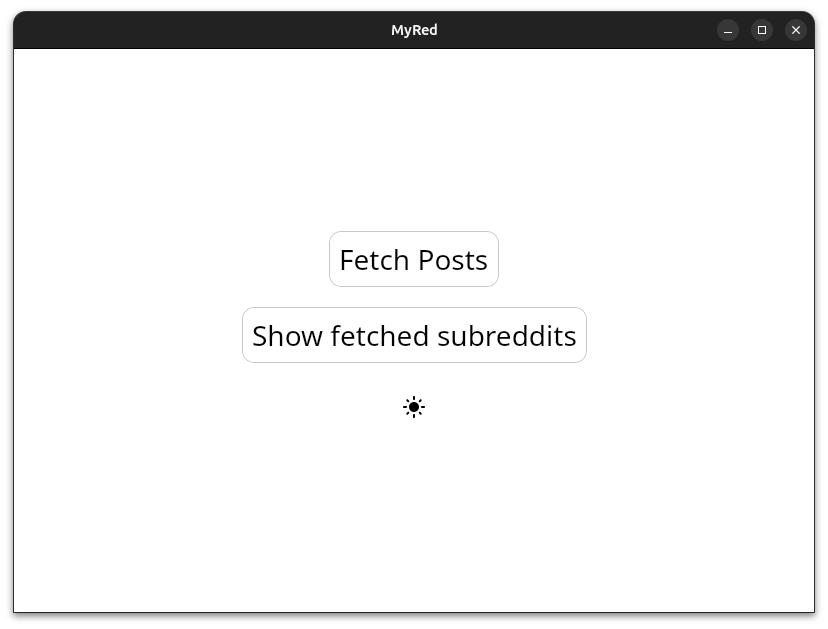
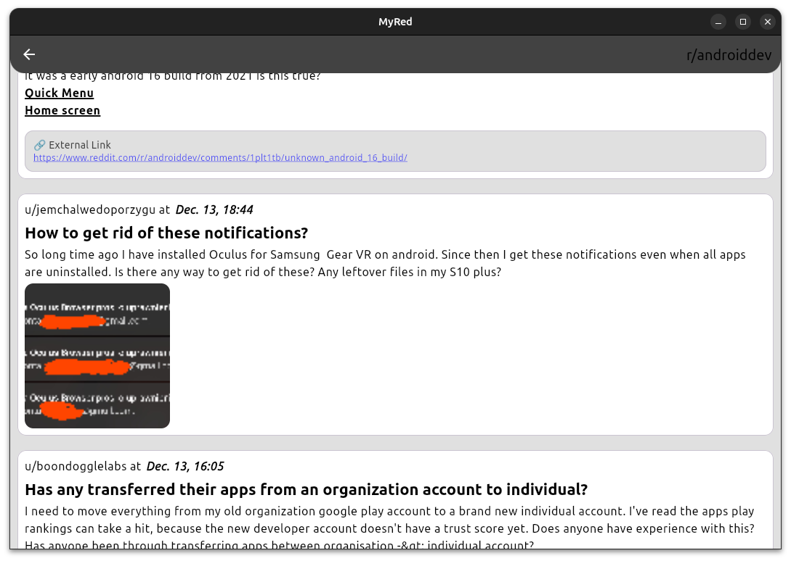
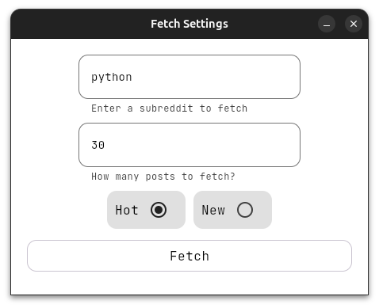
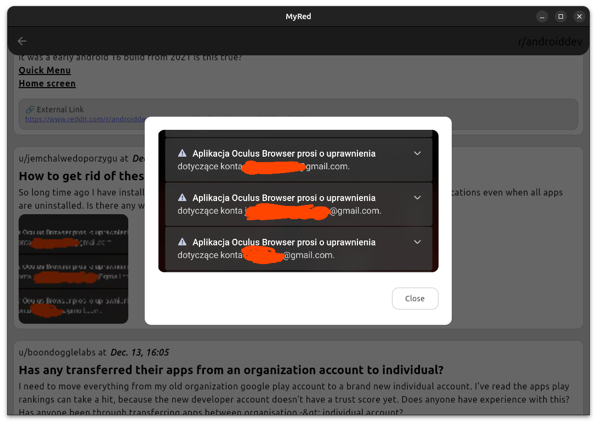

# MyRed

A Reddit desktop client built with Kotlin and Compose for Desktop.

[](https://kotlinlang.org) [](https://www.jetbrains.com/lp/compose-multiplatform/)

## Features

- Browse Reddit posts from any subreddit
- View images, videos, galleries, and text posts
- Fetch hot and new posts with configurable limits
- Material 3 design with dark mode support
- Markdown rendering for post content
- Cross-platform (Windows, macOS, Linux)

## Screenshots

### Entry Screen


### Posts View


### Fetch Settings


### Image Viewer


## Work in Progress

This application is currently under active development. Features and functionality are subject to change.

## Development Setup

### Prerequisites

- JDK 17 or later
- Kotlin 2.2.21 or later
- IntelliJ IDEA (recommended) or Android Studio
- Reddit API credentials (CLIENT_ID and CLIENT_SECRET)

### Reddit API Setup

1. Create a Reddit app at https://www.reddit.com/prefs/apps
2. Select "script" as the app type
3. Set the following environment variables:
   ```bash
   export CLIENT_ID="your_client_id"
   export CLIENT_SECRET="your_client_secret"
   ```

### Make Gradle Wrapper Executable (Linux/macOS only)

After cloning the repository, you need to make the Gradle wrapper executable:

```bash
chmod +x gradlew
```

**Note:** This step is not required on Windows as it uses `gradlew.bat`.

### Running the Application

#### Standard Run
```bash
./gradlew run
```

#### Hot Reload (Recommended for Development)
```bash
./gradlew :hotRun --mainClass MyRed --auto
```

This enables automatic recompilation and hot swapping when you modify your code, making development much faster.

### Building a Native Distribution

To build a native distribution for your platform:

```bash
./gradlew packageDistributionForCurrentOS
```

This will create a platform-specific installer in the `build/compose/binaries/main-release/{extension}/` directory.

### Available Gradle Tasks

- `./gradlew run` - Run the application
- `./gradlew :hotRun --mainClass MyRed --auto` - Run with hot reload
- `./gradlew packageDistributionForCurrentOS` - Build native distribution for current OS
- `./gradlew packageDmg` - Build macOS DMG (macOS only)
- `./gradlew packageMsi` - Build Windows MSI (Windows only)
- `./gradlew packageExe` - Build Windows EXE (Windows only)
- `./gradlew packageDeb` - Build Linux DEB (Linux only)
- `./gradlew packageDebWithWMClass` - Build Linux DEB with proper desktop integration (JRE bundled)

## Tech Stack

- Kotlin 2.2.21
- Compose Multiplatform 1.9.3
- Material 3
- Koin (Dependency Injection)
- OkHttp (HTTP client)
- Kotlinx Serialization
- Sketch (Image loading)
- VLCj (Video playback)
- Mikepenz Markdown Renderer